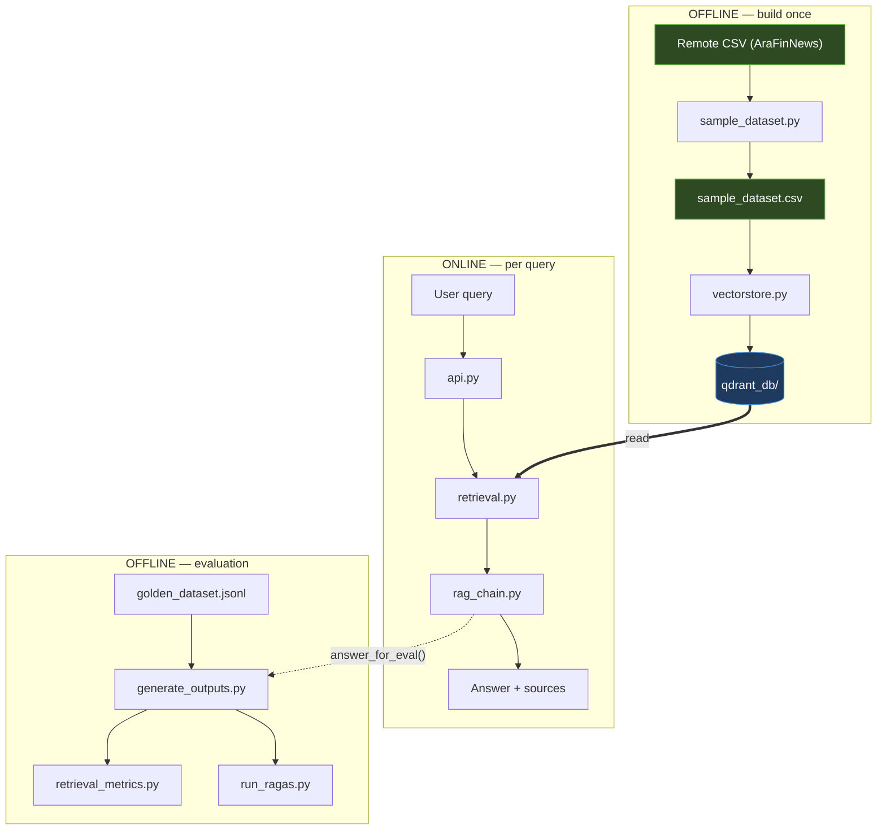
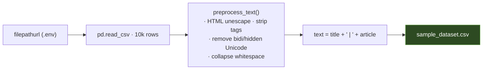
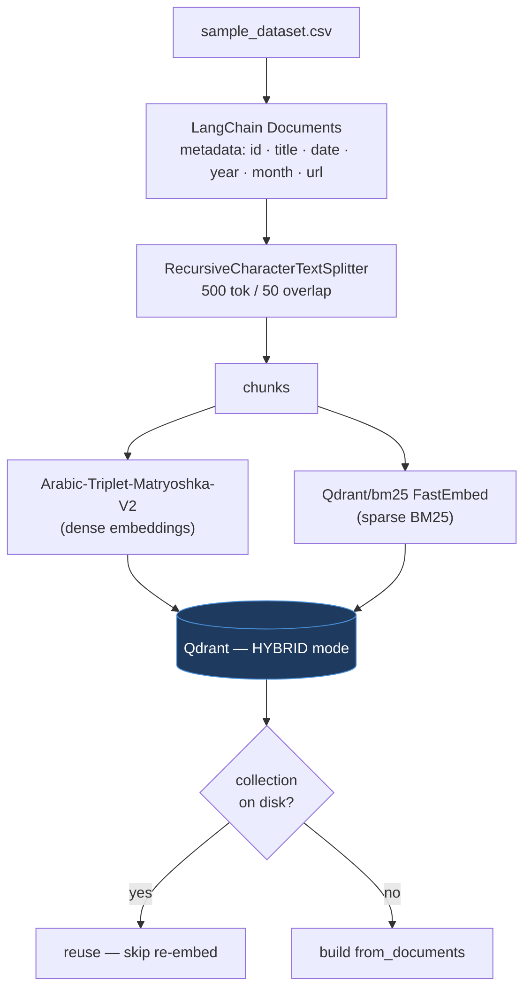
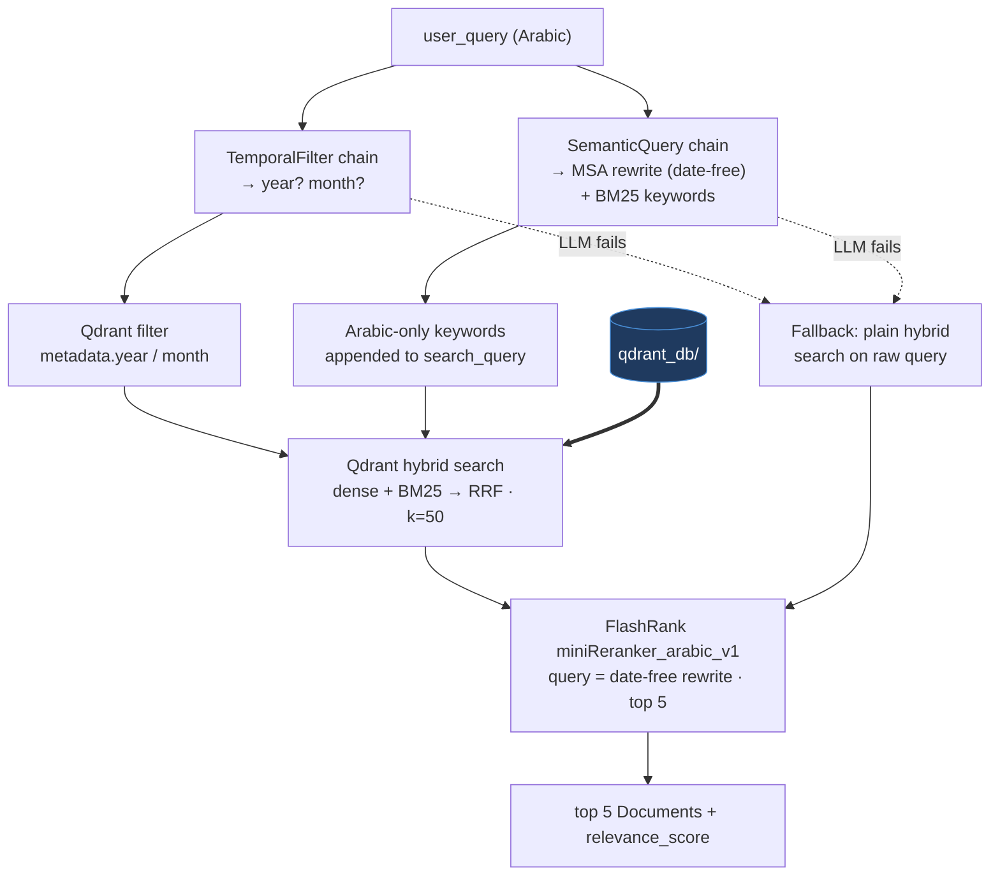
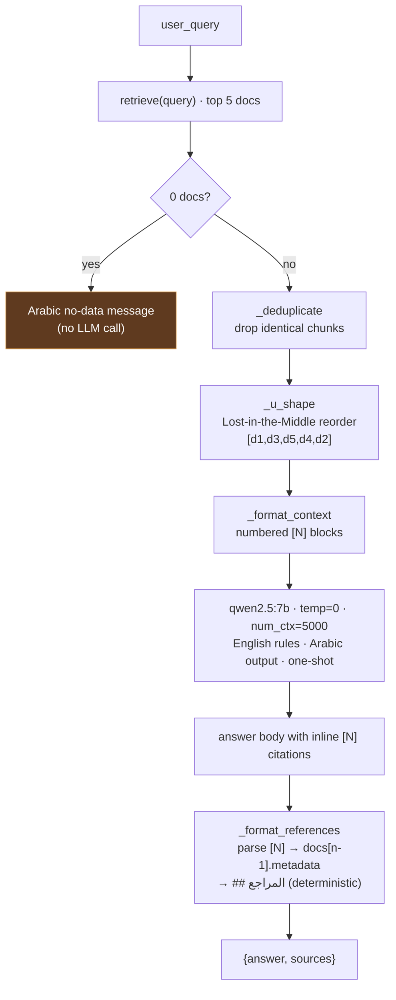
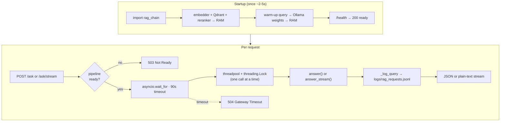
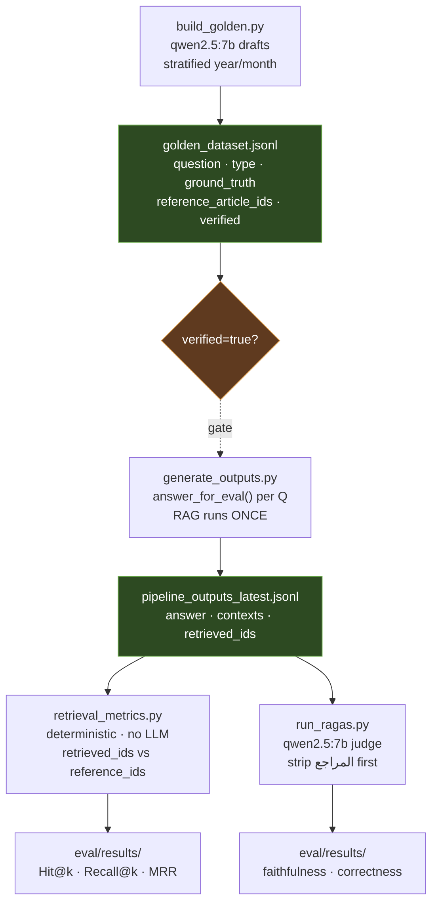
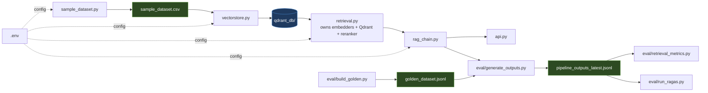

# ArabFinancial News — End-to-End Flow

Arabic financial-news RAG pipeline from raw CSV to a cited answer served over HTTP.
Built on the [AraFinNews](https://github.com/ArabicNLP-UK/AraFinNews) dataset (~10k articles).

---

## 1. Top-level pipeline

Three phases: **build** runs once per dataset refresh, **serve** runs per user query, **eval** is an offline harness that reuses the serve path.



The serve phase only *reads* `qdrant_db/` — it never re-embeds. Eval drives `answer_for_eval()` so scores reflect the exact production path.

---

## 2. Offline — Data → Vector store

### 2a. Data loading — `sample_dataset.py`



### 2b. EDA — `exploratory_tokens.py`

Standalone token-length analysis (tiktoken `cl100k_base`) → `token_distribution.png`. Justifies `chunk_size=500 / overlap=50`. Does not feed the store.

### 2c. Ingest — `vectorstore.py`



Metadata is nested under `"metadata."` in Qdrant payload — retrieval filters must prefix field names (e.g. `metadata.year`).

---

## 3. Online — Retrieval — `retrieval.py`

`retrieve(user_query, k_candidates=50) → list[Document]` (top 5, sorted by rerank score). All state initialized **once on import**.



Dates are stripped before reranking — the date constraint is already enforced by the Qdrant filter, so passing them dilutes the semantic signal.

---

## 4. Online — Augmentation — `rag_chain.py`

`answer(query) → {answer, sources}` and `answer_stream(query)` (token generator). Calls `retrieve()` — never loads the retrieval stack directly.



`[N]` numbering is bound to the post-`_u_shape` order. `_format_references` renders the bibliography from metadata — URLs are exact and never hallucinated.

---

## 5. Online — Serving — `api.py`

FastAPI HTTP layer. Pipeline loads once at startup; all requests are serialized behind a lock.



`--workers 1` is required — multiple workers would each load the full pipeline and contend on the Qdrant file lock.

---

## 6. Offline — Evaluation — `eval/`

Generate once, score twice. `answer_for_eval()` returns the same generation plus `contexts` and `retrieved_ids` for metrics.



```bash
python eval/generate_outputs.py    # 1. slow — RAG once → shared dump
python eval/retrieval_metrics.py   # 2. instant — no model load
python eval/run_ragas.py           # 3. slow — Ragas judge only
```

Known finding: `comparison`/`multi_hop` bottleneck at Recall@5 ≈ 0.5 — single-query retrieval fetches one of two needed articles. Fix = query decomposition.

---

## 7. Module dependency graph



`retrieval.py` is the only module that loads the embedders, Qdrant client, and reranker. Everything else goes through `retrieve()` or `answer*()`.

---

## Stage → file → artifact

| Stage | File | Reads | Produces |
|---|---|---|---|
| Data | `sample_dataset.py` | remote CSV | `sample_dataset.csv` |
| EDA | `exploratory_tokens.py` | `sample_dataset.csv` | `token_distribution.png` |
| Ingest | `vectorstore.py` | `sample_dataset.csv` | `qdrant_db/` |
| Retrieval | `retrieval.py` | `qdrant_db/` | `list[Document]` (top 5) |
| Augmentation | `rag_chain.py` | `retrieve()` | `{answer, sources}` |
| Serving | `api.py` | `answer()` / `answer_stream()` | HTTP response / stream |
| Golden set | `eval/build_golden.py` | `sample_dataset.csv` | `golden_dataset.jsonl` |
| Generate | `eval/generate_outputs.py` | golden + `answer_for_eval` | `pipeline_outputs_latest.jsonl` |
| Retrieval metrics | `eval/retrieval_metrics.py` | dump | `eval/results/` |
| Generation metrics | `eval/run_ragas.py` | dump | `eval/results/` |
