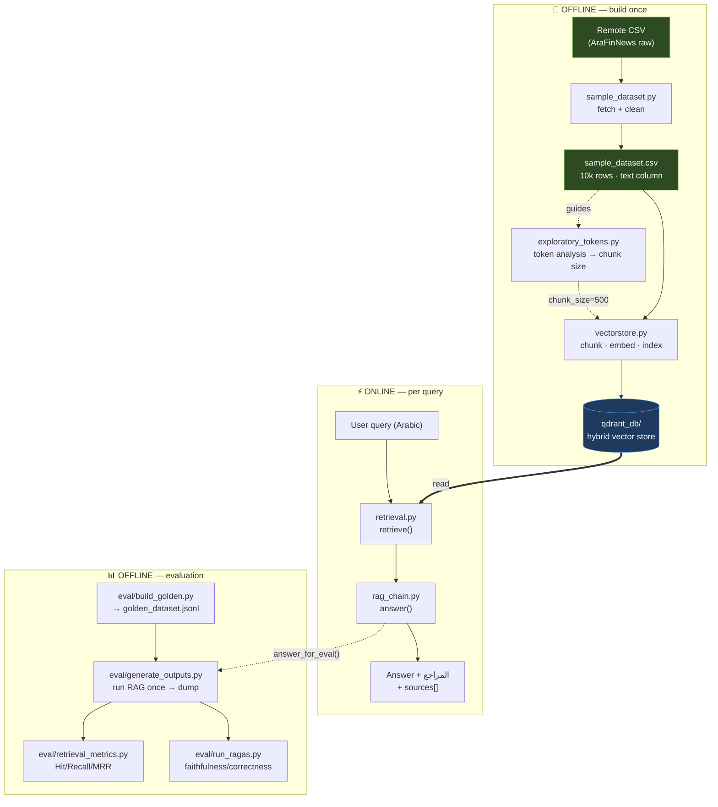
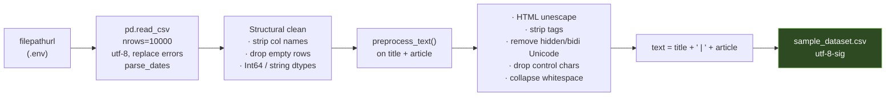
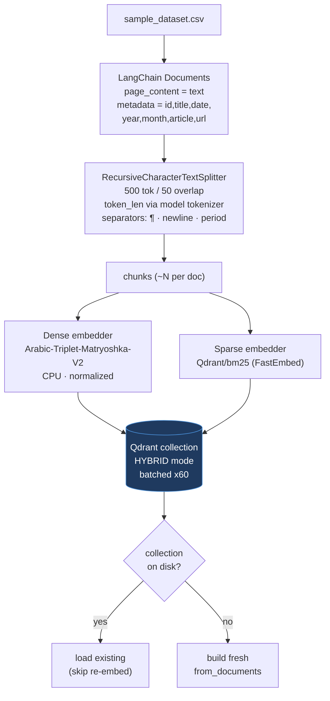
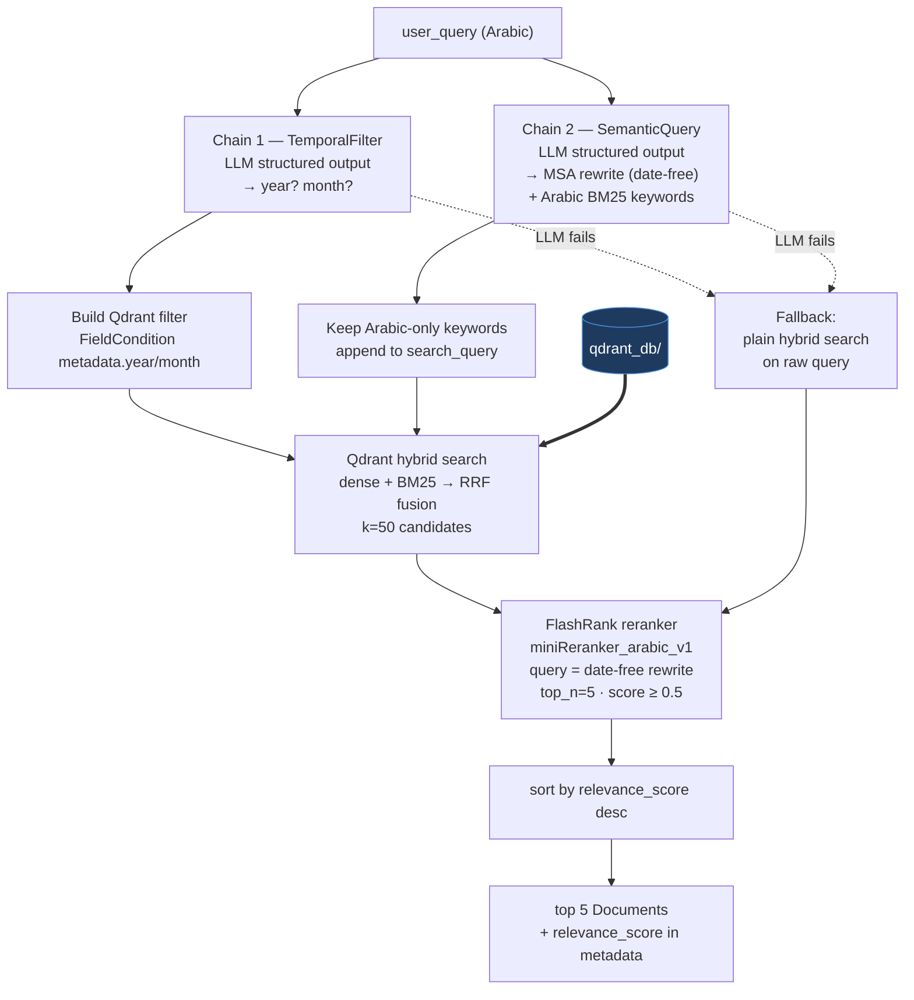
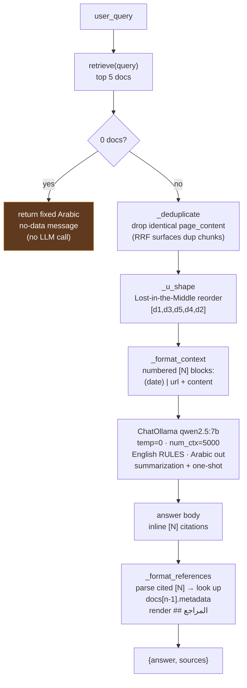
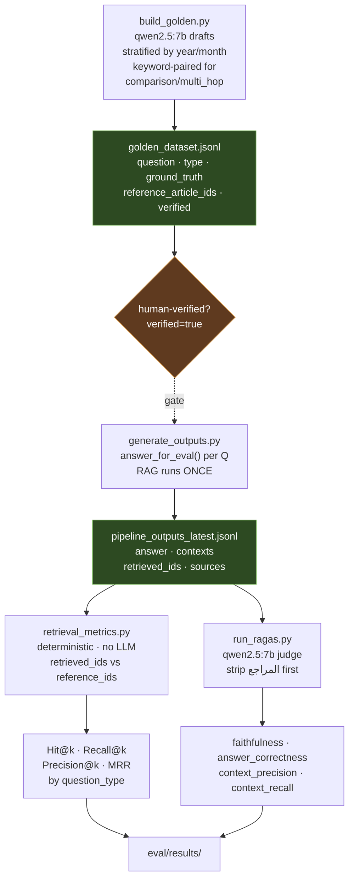
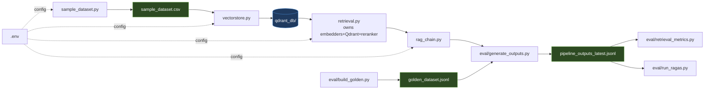

# ArabFinancial News — End-to-End Flow

A walkthrough of the Arabic financial-news RAG pipeline, from raw CSV to a
cited Arabic answer and evaluation scores. Every stage below maps to a real
file in this repo (see the per-stage notes).

> Built on the [AraFinNews](https://github.com/ArabicNLP-UK/AraFinNews)
> dataset (~10k articles). Local-only stack: HuggingFace embeddings + Qdrant
> hybrid search + FlashRank Arabic reranker + `qwen2.5:7b` via Ollama.

---

## 1. Top-level pipeline

Two phases. The **offline / build** phase runs rarely (once per dataset
refresh); the **online / serve** phase runs per user query. Evaluation is an
offline harness that reuses the serve path.



**Key dependency:** the serve phase only *reads* `qdrant_db/`. It never
re-embeds or re-indexes. The eval phase drives the same `rag_chain` entry point
(`answer_for_eval`) so scores reflect the production path exactly.

---

## 2. Offline — Data → Vector store

### 2a. Data loading & preprocessing — `sample_dataset.py`



The `text` column (`title | article`) is what gets embedded. Cleaning targets
the noise specific to scraped Arabic web text: HTML entities, zero-width and
bidi-override characters, and control bytes.

### 2b. EDA (advisory) — `exploratory_tokens.py`

Standalone token-length analysis on the `text` column (tiktoken `cl100k_base`).
Prints percentile stats and saves `token_distribution.png`. It does **not**
feed the store — it justifies the `chunk_size=500 / overlap=50` choice.

### 2c. Ingest — `vectorstore.py`



Each chunk carries the full metadata payload. `langchain_qdrant` nests it under
a `"metadata."` payload key — which is why retrieval filters must prefix field
names (`metadata.year`). Idempotent: a populated collection on disk is reused,
not rebuilt.

---

## 3. Online — Retrieval — `retrieval.py`

Public API: `retrieve(user_query, k_candidates=50) -> list[Document]` (top 5,
sorted by rerank score). Module state (embedders, Qdrant client, reranker) is
initialized **once on import** and `_`-prefixed.



**Design notes baked into the code**
- **Dates stripped before reranking.** The reranker receives the date-free
  `search_query`; the date constraint is already enforced by the Qdrant filter,
  so passing dates would dilute the semantic signal.
- **Arabic reranker is mandatory.** English rerankers degrade on Arabic.
- **Self-query split into two focused chains** (temporal vs. semantic) — each is
  more reliable than one combined extraction on a moderate 7B.
- **Graceful fallback:** any LLM parse error drops to plain hybrid search.

---

## 4. Online — Augmentation / Generation — `rag_chain.py`

Public API: `answer(query) -> {answer, sources}`. Does **not** re-load the
retrieval stack — it calls `retrieve()`.



**Why it's built this way**
- **Citations split by responsibility.** The LLM emits the semantic `[N]`
  markers; `_format_references` renders the bibliography *deterministically*
  from metadata, so URLs are exact and never hallucinated.
- **Ordering is load-bearing.** `[N]` numbering binds to the post-`_u_shape`
  order — docs must not be reordered between `_format_context` and
  `_format_references`.
- **`num_ctx=5000`** is sized for 5 Arabic chunks; the default 2048 silently
  truncates and trips the no-data fallback.
- **Prompt diverged from the original Arabic-only spec:** English numbered
  rules + summarization framing + one-shot example produce more reliable inline
  citations from a 7B than Arabic instructions did.

---

## 5. Offline — Evaluation — `eval/`

The eval harness reuses the serve path via `answer_for_eval()`, which returns
the same generation plus the inputs metrics need (`contexts`, `retrieved_ids`).
The core principle: **generate once, score twice.**



**Run order**
```bash
python eval/generate_outputs.py    # 1. slow — RAG once → shared dump
python eval/retrieval_metrics.py   # 2. instant — no model load
python eval/run_ragas.py           # 3. slow — Ragas judge only
```

**Caveats that shape the design**
- **One dump, two consumers** — both metric scripts read
  `pipeline_outputs_latest.jsonl`, so reports never drift and the pipeline runs
  once per eval.
- **Judge == generator** (`qwen2.5:7b`): self-grading, so trust by-type deltas
  and run-over-run trends, not absolute numbers.
- **Strip `## المراجع` before judging** — it's code-rendered metadata, not LLM
  claims; scoring it unfairly tanks faithfulness/correctness.
- **`keep_alive="1h"` on the judge is mandatory** — Ragas' serial gaps exceed
  Ollama's default 5-min keep-alive, causing reload-from-disk timeouts.
- **`answer_relevancy` off by default** — its reverse-question step is low-trust
  on Arabic (~0.31).
- **Known finding:** `comparison`/`multi_hop` bottleneck at Recall@5 ≈ 0.5 —
  single-query retrieval fetches one of two needed articles. Fix path = query
  decomposition, not prompt tuning.

---

## 6. Module dependency graph

Who imports whom. Note the single ownership of the retrieval stack.



**Single-ownership rule:** `retrieval.py` is the *only* module that loads the
embedders, Qdrant client, and reranker. `rag_chain.py` and the eval scripts go
through `retrieve()` / `answer*()` — never the heavy stack directly. Everything
is configured from `.env` and has no import-time side effects beyond
`retrieval.py`'s one-time stack init.

---

## Stage → file → artifact summary

| Stage | File | Reads | Produces |
|---|---|---|---|
| Data | `sample_dataset.py` | remote CSV (`.env`) | `sample_dataset.csv` |
| EDA | `exploratory_tokens.py` | `sample_dataset.csv` | `token_distribution.png` |
| Ingest | `vectorstore.py` | `sample_dataset.csv` | `qdrant_db/` |
| Retrieval | `retrieval.py` | `qdrant_db/` | `list[Document]` (top 5) |
| Augmentation | `rag_chain.py` | `retrieve()` | `{answer, sources}` |
| Golden set | `eval/build_golden.py` | `sample_dataset.csv` | `golden_dataset.jsonl` |
| Generate | `eval/generate_outputs.py` | golden + `answer_for_eval` | `pipeline_outputs_latest.jsonl` |
| Retrieval metrics | `eval/retrieval_metrics.py` | dump | `eval/results/` |
| Generation metrics | `eval/run_ragas.py` | dump | `eval/results/` |
